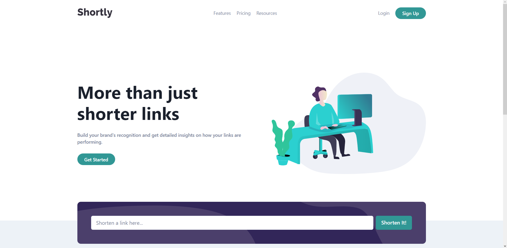
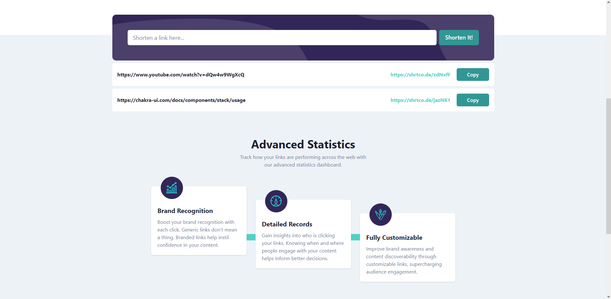
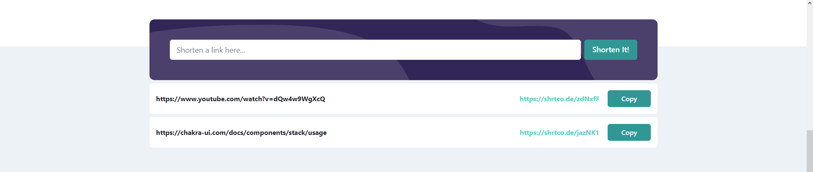
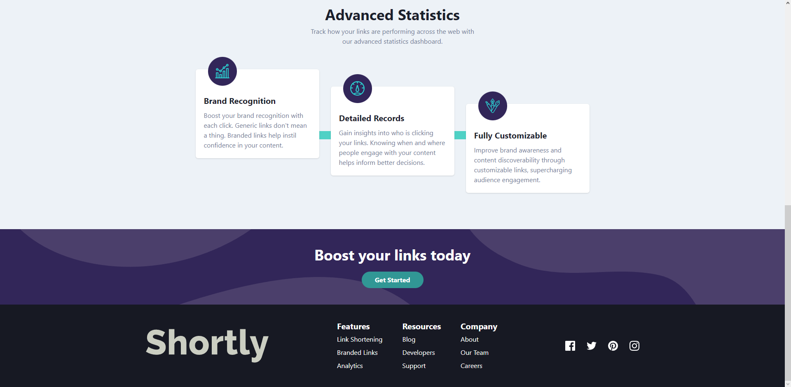

<!-- ABOUT THE PROJECT -->

<a name="readme-top"></a>

# URL Shortener

## Sobre la aplicación

Este es un challenge de la página de FrontEndMentor. Se trata de una api donde se envia un URL y se obtiene una versión acortada que se muestran en forma de lista.

Para este proyecto use ChakraUI para el diseño.

[Sitio web](https://fedeurlshortening.netlify.app/)

[Repositorio](https://github.com/FedericoLuna01/URLShortening)

## Vista previa









### Construida con

- [![Vite][Vite.com]][Vite-url]
- [![React][React.js]][React-url]
- [![Chakra][ChakraUI]][Chakra-url]

<!-- GETTING STARTED -->

## Getting Started

Para tener una copia local de esta aplicación seguí los siguientes pasos.

### Requisitos previos

Instalar la ultima versión de NodeJS.

- npm
  ```sh
  npm install npm@latest -g
  ```

### Instalación

1. Clonar el repositorio.
   ```sh
   git clone https://github.com/FedericoLuna01/URLShortening.git
   ```
2. Instalar los paquetes de NPM.
   ```sh
   npm install
   ```

<p align="right">(<a href="#readme-top">volver arriba</a>)</p>

<!-- CONTACT -->

## Contacto

Federico Luna - [LinkdedIn](https://www.linkedin.com/in/federico-luna-dev/) - [Sitio Web](https://federicoluna.netlify.app) - federicolun4@gmail.com

<p align="right">(<a href="#readme-top">volver arriba</a>)</p>

<!-- MARKDOWN LINKS & IMAGES -->

[React.js]: https://img.shields.io/badge/React-20232A?style=for-the-badge&logo=react&logoColor=61DAFB
[React-url]: https://reactjs.org/
[Vite.com]: https://img.shields.io/badge/Vite-646CFF?style=for-the-badge&logo=vite&logoColor=white
[Vite-url]: https://vitejs.dev/
[ChakraUI]: https://img.shields.io/badge/chakraui-319795?style=for-the-badge&logo=chakraui&logoColor=white
[Chakra-url]: https://chakra-ui.com/
